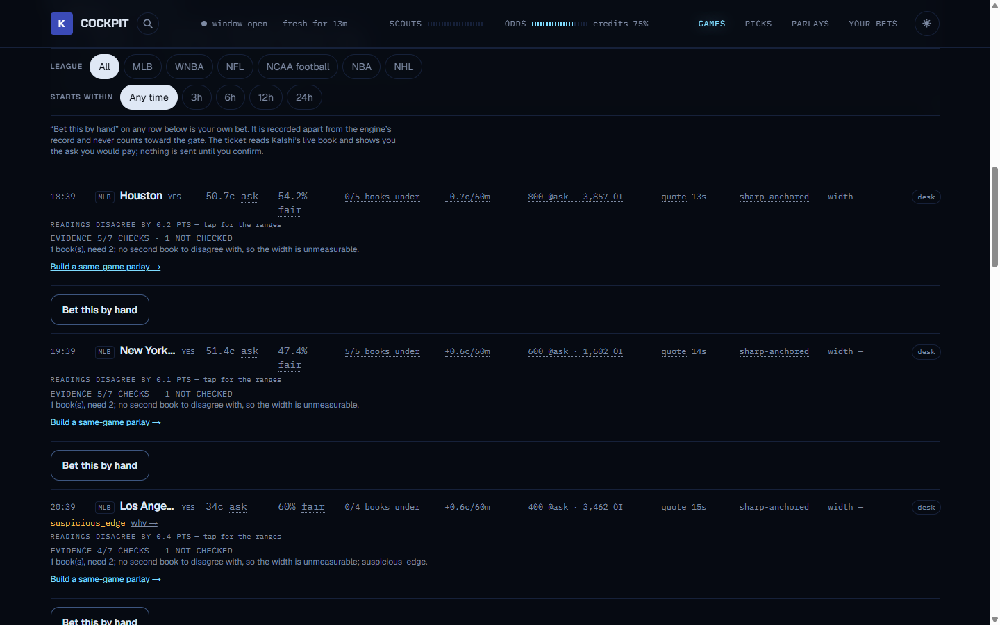

# Kalshi Cockpit

A personal betting desk for [Kalshi](https://kalshi.com). It puts what Kalshi
charges for a bet next to what the sharp sportsbooks say it is worth, lets you
place the bet from the same screen, and keeps the record.

**Try it: [kalshi-cockpit-demo.fly.dev](https://kalshi-cockpit-demo.fly.dev)**
(synthetic data, no login, no real money).



## What you get

- **Games.** Every Kalshi sports market the desk can match to a sportsbook
  line, one row per side. Each row shows the ask you would pay, the fair
  probability from the books, how many books agree, the sharp anchor behind
  it, and the reason the desk flagged or refused it.
- **Picks.** The engine's own candidates after every check has run, with the
  check that stopped each one written on the row.
- **Parlays.** Build a combination, ask Kalshi's market makers for a real
  quote, and take it from the screen. Legs show rest days, back-to-backs and
  short weeks. Paste a parlay built elsewhere and the desk prices each leg.
- **Game page.** Every market on one game in one place, with scout notes, so
  you can build a same-game combination without leaving it.
- **Your bets.** Everything placed through the desk, with the venue's own fill
  price beside what you sent.
- **Hedge.** Watches parlays you already hold, reads each leg's live price
  during the game, and tells you what hedging the endangered leg would do.
- **Scout desk.** Optional LLM agents that brief a slate and give a verdict on
  a leg when you ask. They spend under a daily token budget.

It works equally from a phone and a desktop, and installs to a home screen.

## How it prices a bet

The desk buys odds from ten named sportsbooks, strips the vig four different
ways, and uses the **worst** of the four so no edge survives that is an
artifact of method choice. The fee is included before anything is called
bettable. A large apparent edge is treated as a bug until proven otherwise and
is suppressed, not surfaced.

Be clear about what this is. Kalshi's advantage over a sportsbook is **cost,
not information**: a bet at 50c needs about 51.8% to break even against 52.4%
at a -110 book. That is a discount of about 0.6 points, and the sportsbook
consensus has been measured and does not predict Kalshi's closing line. So the
desk **shows** the gap on every row and **never ranks by it**. Price
transparency at the moment of a bet is the product.

The full research record, including the measurements that closed each line of
attack, is in [`docs/history/readme-2026-10-06.md`](docs/history/readme-2026-10-06.md).

## Run it

```bash
python -m venv .venv && .venv/bin/pip install -r requirements-dev.txt
python -m backend.main --seed-demo          # API on :8000, synthetic slate
cd frontend && npm install && npm run dev   # cockpit on :3000
python -m pytest -q                         # the suite
```

The demo seed needs no credentials and has no order path.

### Point it at your own account

Copy [`.env.example`](.env.example) to `.env`. The keys that matter:

| Key | What it is |
|---|---|
| `KALSHI_API_KEY`, `KALSHI_PRIVATE_KEY_PATH` | Your Kalshi API credentials. The private key never enters the repo. |
| `ODDS_API_KEY` | [The Odds API](https://the-odds-api.com), for sportsbook lines. |
| `APP_AUTH_TOKEN` | Login for the cockpit. Every mutating route requires it. |
| `INSTANCE_MODE` | `demo` or `live`. Live refuses to boot without real credentials. |
| `ANTHROPIC_API_KEY` | Optional. Turns on the scout desk. |

Hosting is on [Fly.io](https://fly.io): `fly.demo.toml` and `fly.live.toml`
deploy the same image in the two modes, and secrets are set with
`flyctl secrets set`.

### Before you trust it with money

- Hand orders go to Kalshi as immediate-or-cancel orders at your tap, with
  the price you confirmed. The server re-checks the price, depth and the
  venue's collateral rule itself. It does not trust that the button was
  disabled.
- Asking makers for a combination quote commits to nothing. Taking one
  spends.
- Nothing on the order path retries. A lost response is recorded as unknown,
  not as a failure, and a second tap is refused.
- The engine's automated orders have never been armed. Resting bids are
  disabled.
- Demo and live are separate deploys from one image. The demo's order routes
  answer 403 by construction.

### Run your own copy

Kalshi's Developer Agreement forbids sharing API-derived data with third
parties, so a hosted instance that friends can visit is not compliant. Sharing
this tool means someone runs their own copy.

## Where the record lives

Decisions in [`docs/adr/`](docs/adr/), measurements and their registrations in
[`docs/measurements/`](docs/measurements/), and things that went wrong in
[`tasks/lessons.md`](tasks/lessons.md), written as patterns rather than
incidents.

## Attribution

**The information used here was obtained free of charge from and is copyrighted
by [Retrosheet](https://www.retrosheet.org/).** Retrosheet supplies the
historical baseball statistics behind every derived baseball number here, used
to estimate the parameters in
[`backend/model/strikeouts.py`](backend/model/strikeouts.py); its terms permit
commercial use and ask only for this notice. See
[ADR 0035](docs/adr/0035-mlb-stat-data-is-split-across-two-sources-on-licence-grounds.md)
for the split.

Kalshi and The Odds API supply prices, under their own separate terms. Design
system shared with
[josephsapinoso.com](https://github.com/josephsapinoso/personal-website).
